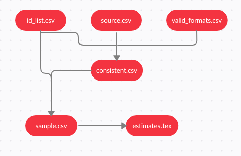

# Make

## Getting Started <a href="#getting-started" id="getting-started"></a>

### Why do we need Makefiles? <a href="#why-do-makefiles-exist" id="why-do-makefiles-exist"></a>

Makefiles are used to help decide which parts of a large program need to be recompiled. In a data-intensive project it can be helpful in determining which data transformations or analysis codes need to be re-run due to a change. In general terms, it can be used when you need a series of instructions to run depending on what files have changed. This tutorial will focus on the data analysis use case.

Here's an example dependency graph that you might build with Make. If any file's list of dependencies changes, then the file will get re-created:



### Running the Examples <a href="#running-the-examples" id="running-the-examples"></a>

To run these examples, you'll need a terminal and "make" installed. For each example, put the contents in a file called `Makefile`, and in that directory run the command `make`. Let's start with the simplest of Makefiles:

```bash
hello:
    echo "hello world"
```

Here is the output of running the above example:

```bash
$ make
echo "hello world"
hello world
```

That's it!&#x20;

### Makefile Syntax <a href="#makefile-syntax" id="makefile-syntax"></a>

A Makefile consists of a set of _rules_. A rule generally looks like this:

```
targets: prerequisites
   command
   command
   command
```

* The _targets_ are file names, separated by spaces. Typically, there is only one per rule.
* The _commands_ are a series of steps typically used to make the target(s). These _need to start with a tab character_, not spaces.
* The _prerequisites_ are also file names, separated by spaces. These files need to exist before the commands for the target are run. These are also called _dependencies_

### Beginner Examples <a href="#beginner-examples" id="beginner-examples"></a>

The following Makefile has three separate _rules_. When you run `make sample.csv` in the terminal, it will create a dataset called sample.csv in a series of steps:

* Make is given `sample.csv` as the target, so it first searches for this target
* `sample.csv` requires `consistent.csv`, so make searches for the `consistent.csv` target
* `consistent.csv` requires `source.csv`, so make searches for the `source.csv` target
* `source.csv` has no dependencies, so the `test` command is run
* The `python` command is then run, because all of the `consistent.csv` dependencies are finished
* The top `stata` command is run, because all the `sample.csv` dependencies are finished
* That's it: `sample.csv` is our last dataset to create.

```
sample.csv: consistent.csv
    stata -b create_sample.do # Runs third

consistent.csv: source.csv
    python clean_data.py # Runs second

source.csv:
    test -f source.csv && echo "$FILE exists." # Runs first
```

This makefile has a single target, called `some_file`. The default target is the first target, so in this case `some_file` will run. Notice that the command below does not create any actual file, it is a simple `echo` command.

```
some_file:
    echo "This line will always print"
```

This file will make `some_file`, which is an actual file in this case. The first time we run this code the file `some_file` will be created. The second time you try to make it - since it's already made and the dependencies did not change - it will result in `make: 'some_file' is up to date.`

```
some_file:
    echo "This line will only print once"
    touch some_file
```

Here, the target `some_file` "depends" on `other_file`. When we run `make`, the default target (`some_file`, since it's first) will get called. It will first look at its list of _dependencies_, and if any of them are older, it will first run the targets for those dependencies, and then run itself. The second time this is run, neither target will run because both targets exist.

```
some_file: other_file
    echo "This will run second, because it depends on other_file"
    touch some_file

other_file:
    echo "This will run first"
    touch other_file
```

This will always run both targets, because `some_file` depends on `other_file`, which is never created.

```
some_file: other_file
    touch some_file

other_file:
    echo "nothing"
```

`clean` is often used as a target that removes the output of other targets, but it is not a special word in `make`.

```
some_file: 
    touch some_file

clean:
    rm -f some_file
```

### Variables <a href="#variables" id="variables"></a>

Variables can only be strings. Here's an example of using them:

```
files = file1 file2
some_file: $(files)
    echo "Look at this variable: " $(files)
    touch some_file

file1:
    touch file1
file2:
    touch file2

clean:
    rm -f file1 file2 some_file
```

You can reference variables using `${}` or `$().`

```
x = dude

all:
    echo $(x)
    echo ${x}

    # Bad practice, but works
    echo $x
```

## Targets <a href="#targets" id="targets"></a>

### The all target <a href="#the-all-target" id="the-all-target"></a>

Making multiple targets and you want all of them to run? Make an `all` target.

```
all: one two three

one:
    touch one
two:
    touch two
three:
    touch three

clean:
    rm -f one two three
```

### Multiple targets <a href="#multiple-targets" id="multiple-targets"></a>

When there are multiple targets for a rule, the commands will be run for each target\
`$@` is an automatic variable that contains the target name.

```
all: file1 file2

file1 file2:
    echo $@
# Equivalent to:
# file1
#     echo $@
# file2
#     echo $@
```

## Automatic Variables and Wildcards <a href="#automatic-variables-and-wildcards" id="automatic-variables-and-wildcards"></a>

### \* Wildcard <a href="#wildcard" id="wildcard"></a>

Both `*` and `%` are called wildcards in Make, but they mean entirely different things. `*` searches your filesystem for matching filenames. I suggest that you always wrap it in the `wildcard` function, because otherwise you may fall into a common pitfall described below. It's oddly unhelpful and I find it more confusing than useful.

```
# Print out file information about every .csv file
print: $(wildcard *.csv)
    ls -la  $?
```

`*` may be used in the target, prerequisites, or in the `wildcard` function.

Danger: `*` may not be directly used in variable definitions

Danger: When `*` matches no files, it is left as it is (unless run in the `wildcard` function)

```
thing_wrong := *.csv # Don't do this! '*' will not get expanded
thing_right := $(wildcard *.csv)

all: one two three four

# Fails, because $(thing_wrong) is the string "*.csv"
one: $(thing_wrong)

# Stays as *.csv if there are no files that match this pattern :(
two: *.o 

# Works as you would expect! In this case, it does nothing.
three: $(thing_right)

# Same as rule three
four: $(wildcard *.csv)
```

### % Wildcard <a href="#wildcard" id="wildcard"></a>

`%` is really useful, but is somewhat confusing because of the variety of situations it can be used in.

* When used in "matching" mode, it matches one or more characters in a string. This match is called the stem.
* When used in "replacing" mode, it takes the stem that was matched and replaces that in a string.
* `%` is most often used in rule definitions and in some specific functions.

See these sections on examples of it being used:

* Static Pattern Rules
* Pattern Rules
* String Substitution
* The vpath Directive

### Automatic Variables <a href="#automatic-variables" id="automatic-variables"></a>

There are many [automatic variables](https://www.gnu.org/software/make/manual/html\_node/Automatic-Variables.html), but often only a few show up:

```
hey: one two
    # Outputs "hey", since this is the first target
    echo $@

    # Outputs all prerequisites newer than the target
    echo $?

    # Outputs all prerequisites
    echo $^

    touch hey

one:
    touch one

two:
    touch two

clean:
    rm -f hey one two
```

## Fancy Rules <a href="#fancy-rules" id="fancy-rules"></a>

### Static Pattern Rules <a href="#static-pattern-rules" id="static-pattern-rules"></a>

Make loves c compilation. And every time it expresses its love, things get confusing. Here's the syntax for a new type of rule called a static pattern:

```
targets ...: target-pattern: prereq-patterns ...
   commands
```

The essence is that the given target is matched by the target-pattern (via a `%` wildcard). Whatever was matched is called the _stem_. The stem is then substituted into the prereq-pattern, to generate the target's prereqs.

A typical use case is to compile `.c` files into `.o` files. Here's the _manual way_:

```
objects = foo.o bar.o all.o
all: $(objects)

# These files compile via implicit rules
foo.o: foo.c
bar.o: bar.c
all.o: all.c

all.c:
    echo "int main() { return 0; }" > all.c

%.c:
    touch $@

clean:
    rm -f *.c *.o all
```

Here's the more _efficient way_, using a static pattern rule:

```
objects = foo.o bar.o all.o
all: $(objects)

# These files compile via implicit rules
# Syntax - targets ...: target-pattern: prereq-patterns ...
# In the case of the first target, foo.o, the target-pattern matches foo.o and sets the "stem" to be "foo".
# It then replaces the '%' in prereq-patterns with that stem
$(objects): %.o: %.c

all.c:
    echo "int main() { return 0; }" > all.c

%.c:
    touch $@

clean:
    rm -f *.c *.o all
```

### Static Pattern Rules and Filter <a href="#static-pattern-rules-and-filter" id="static-pattern-rules-and-filter"></a>

While I introduce functions later on, I'll forshadow what you can do with them. The `filter` function can be used in Static pattern rules to match the correct files. In this example, I made up the `.raw` and `.result` extensions.

```
obj_files = foo.result bar.o lose.o
src_files = foo.raw bar.c lose.c

all: $(obj_files)

$(filter %.o,$(obj_files)): %.o: %.c
    echo "target: $@ prereq: $<"
$(filter %.result,$(obj_files)): %.result: %.raw
    echo "target: $@ prereq: $<" 

%.c %.raw:
    touch $@

clean:
    rm -f $(src_files)
```

### Implicit Rules <a href="#implicit-rules" id="implicit-rules"></a>

Perhaps the most confusing part of make is the magic rules and variables that are made. Here's a list of implicit rules:

* Compiling a C program: `n.o` is made automatically from `n.c` with a command of the form `$(CC) -c $(CPPFLAGS) $(CFLAGS)`
* Compiling a C++ program: `n.o` is made automatically from `n.cc` or `n.cpp` with a command of the form `$(CXX) -c $(CPPFLAGS) $(CXXFLAGS)`
* Linking a single object file: `n` is made automatically from `n.o` by running the command `$(CC) $(LDFLAGS) n.o $(LOADLIBES) $(LDLIBS)`

As such, the important variables used by implicit rules are:

* `CC`: Program for compiling C programs; default cc
* `CXX`: Program for compiling C++ programs; default G++
* `CFLAGS`: Extra flags to give to the C compiler
* `CXXFLAGS`: Extra flags to give to the C++ compiler
* `CPPFLAGS`: Extra flags to give to the C preprosessor
* `LDFLAGS`: Extra flags to give to compilers when they are supposed to invoke the linker

```
CC = gcc # Flag for implicit rules
CFLAGS = -g # Flag for implicit rules. Turn on debug info

# Implicit rule #1: blah is built via the C linker implicit rule
# Implicit rule #2: blah.o is built via the C compilation implicit rule, because blah.c exists
blah: blah.o

blah.c:
    echo "int main() { return 0; }" > blah.c

clean:
    rm -f blah*
```

### Pattern Rules <a href="#pattern-rules" id="pattern-rules"></a>

Pattern rules are often used but quite confusing. You can look at them as two ways:

* A way to define your own implicit rules
* A simpler form of static pattern rules

Let's start with an example first:

```
# Define a pattern rule that compiles every .c file into a .o file
%.o : %.c
        $(CC) -c $(CFLAGS) $(CPPFLAGS) $< -o $@
```

Pattern rules contain a '%' in the target. This '%' matches any nonempty string, and the other characters match themselves. ‘%’ in a prerequisite of a pattern rule stands for the same stem that was matched by the ‘%’ in the target.

Here's another example:

```
# Define a pattern rule that has no pattern in the prerequisites.
# This just creates empty .c files when needed.
%.c:
   touch $@
```

### Double-Colon Rules <a href="#double-colon-rules" id="double-colon-rules"></a>

Double-Colon Rules are rarely used, but allow multiple rules to be defined for the same target. If these were single colons, a warning would be printed and only the second set of commands would run.

```
all: blah

blah::
    echo "hello"

blah::
    echo "hello again"
```

## Commands and execution <a href="#commands-and-execution" id="commands-and-execution"></a>

### Command Echoing/Silencing <a href="#command-echoing-silencing" id="command-echoing-silencing"></a>

Add an `@` before a command to stop it from being printed\
You can also run make with `-s` to add an `@` before each line

```
all: 
    @echo "This make line will not be printed"
    echo "But this will"
```

### Command Execution <a href="#command-execution" id="command-execution"></a>

Each command is run in a new shell (or at least the effect is as such)

```
all: 
    cd ..
    # The cd above does not affect this line, because each command is effectively run in a new shell
    echo `pwd`

    # This cd command affects the next because they are on the same line
    cd ..;echo `pwd`

    # Same as above
    cd ..; \
    echo `pwd`
```

### Default Shell <a href="#default-shell" id="default-shell"></a>

The default shell is `/bin/sh`. You can change this by changing the variable SHELL:

```
SHELL=/bin/bash

cool:
    echo "Hello from bash"
```

### Error handling with `-k`, `-i`, and `-` <a href="#error-handling-with-k-i-and" id="error-handling-with-k-i-and"></a>

Add `-k` when running make to continue running even in the face of errors. Helpful if you want to see all the errors of Make at once.\
Add a `-` before a command to suppress the error\
Add `-i` to make to have this happen for every command.

```
one:
    # This error will be printed but ignored, and make will continue to run
    -false
    touch one
```

### Interrupting or killing make <a href="#interrupting-or-killing-make" id="interrupting-or-killing-make"></a>

Note only: If you `ctrl+c` make, it will delete the newer targets it just made.

### Recursive use of make <a href="#recursive-use-of-make" id="recursive-use-of-make"></a>

To recursively call a makefile, use the special `$(MAKE)` instead of `make` because it will pass the make flags for you and won't itself be affected by them.

```
new_contents = "hello:\n\ttouch inside_file"
all:
    mkdir -p subdir
    printf $(new_contents) | sed -e 's/^ //' > subdir/makefile
    cd subdir && $(MAKE)

clean:
    rm -rf subdir
```

### Use export for recursive make <a href="#use-export-for-recursive-make" id="use-export-for-recursive-make"></a>

The export directive takes a variable and makes it accessible to sub-make commands. In this example, `cooly` is exported such that the makefile in subdir can use it.

Note: export has the same syntax as sh, but they aren't related (although similar in function)

```
new_contents = "hello:\n\\techo \$$(cooly)"

all:
    mkdir -p subdir
    echo $(new_contents) | sed -e 's/^ //' > subdir/makefile
    @echo "---MAKEFILE CONTENTS---"
    @cd subdir && cat makefile
    @echo "---END MAKEFILE CONTENTS---"
    cd subdir && $(MAKE)

# Note that variables and exports. They are set/affected globally.
cooly = "The subdirectory can see me!"
export cooly
# This would nullify the line above: unexport cooly

clean:
    rm -rf subdir
```

You need to export variables to have them run in the shell as well.

```
one=this will only work locally
export two=we can run subcommands with this

all: 
    @echo $(one)
    @echo $$one
    @echo $(two)
    @echo $$two
```

`.EXPORT_ALL_VARIABLES` exports all variables for you.

```
.EXPORT_ALL_VARIABLES:
new_contents = "hello:\n\techo \$$(cooly)"

cooly = "The subdirectory can see me!"
# This would nullify the line above: unexport cooly

all:
    mkdir -p subdir
    echo $(new_contents) | sed -e 's/^ //' > subdir/makefile
    @echo "---MAKEFILE CONTENTS---"
    @cd subdir && cat makefile
    @echo "---END MAKEFILE CONTENTS---"
    cd subdir && $(MAKE)

clean:
    rm -rf subdir
```

### Arguments to make <a href="#arguments-to-make" id="arguments-to-make"></a>

There's a nice [list of options](http://www.gnu.org/software/make/manual/make.html#Options-Summary) that can be run from make. Check out `--dry-run`, `--touch`, `--old-file`.

You can have multiple targets to make, i.e. `make clean run test` runs the `clean` goal, then `run`, and then `test`.

## Variables Pt. 2 <a href="#variables-pt-2" id="variables-pt-2"></a>

### Flavors and modification <a href="#flavors-and-modification" id="flavors-and-modification"></a>

There are two flavors of variables:

* recursive (use `=`) - only looks for the variables when the command is _used_, not when it's _defined_.
* simply expanded (use `:=`) - like normal imperative programming -- only those defined so far get expanded

```
# Recursive variable. This will print "later" below
one = one ${later_variable}
# Simply expanded variable. This will not print "later" below
two := two ${later_variable}

later_variable = later

all: 
    echo $(one)
    echo $(two)
```

Simply expanded (using `:=`) allows you to append to a variable. Recursive definitions will give an infinite loop error.

```
one = hello
# one gets defined as a simply expanded variable (:=) and thus can handle appending
one := ${one} there

all: 
    echo $(one)
```

`?=` only sets variables if they have not yet been set

```
one = hello
one ?= will not be set
two ?= will be set

all: 
    echo $(one)
    echo $(two)
```

Spaces at the end of a line are not stripped, but those at the start are. To make a variable with a single space, use `$(nullstring)`

```
with_spaces = hello   # with_spaces has many spaces after "hello"
after = $(with_spaces)there

nullstring =
space = $(nullstring) # Make a variable with a single space.

all: 
    echo "$(after)"
    echo start"$(space)"end
```

An undefined variable is actually an empty string!

```
all: 
    # Undefined variables are just empty strings!
    echo $(nowhere)
```

Use `+=` to append

```
foo := start
foo += more

all: 
    echo $(foo)
```

[String Substitution](https://makefiletutorial.com/#string-substitution) is also a really common and useful way to modify variables. Also check out [Text Functions](https://www.gnu.org/software/make/manual/html\_node/Text-Functions.html#Text-Functions) and [Filename Functions](https://www.gnu.org/software/make/manual/html\_node/File-Name-Functions.html#File-Name-Functions).

### Command line arguments and override <a href="#command-line-arguments-and-override" id="command-line-arguments-and-override"></a>

You can override variables that come from the command line by using `override`. Here we ran make with `make option_one=hi`

```
# Overrides command line arguments
override option_one = did_override
# Does not override command line arguments
option_two = not_override
all: 
    echo $(option_one)
    echo $(option_two)
```

### List of commands and define <a href="#list-of-commands-and-define" id="list-of-commands-and-define"></a>

"define" is actually just a list of commands. It has nothing to do with being a function. Note here that it's a bit different than having a semi-colon between commands, because each is run in a separate shell, as expected.

```
one = export blah="I was set!"; echo $$blah

define two
export blah=set
echo $$blah
endef

# One and two are different.

all: 
    @echo "This prints 'I was set'"
    @$(one)
    @echo "This does not print 'I was set' because each command runs in a separate shell"
    @$(two)
```

### Target-specific variables <a href="#target-specific-variables" id="target-specific-variables"></a>

Variables can be assigned for specific targets

```
all: one = cool

all: 
    echo one is defined: $(one)

other:
    echo one is nothing: $(one)
```

### Pattern-specific variables <a href="#pattern-specific-variables" id="pattern-specific-variables"></a>

You can assign variables for specific target _patterns_

```
%.c: one = cool

blah.c: 
    echo one is defined: $(one)

other:
    echo one is nothing: $(one)
```

## Conditional part of Makefiles <a href="#conditional-part-of-makefiles" id="conditional-part-of-makefiles"></a>

### Conditional if/else <a href="#conditional-if-else" id="conditional-if-else"></a>

```
foo = ok

all:
ifeq ($(foo), ok)
    echo "foo equals ok"
else
    echo "nope"
endif
```

### Check if a variable is empty <a href="#check-if-a-variable-is-empty" id="check-if-a-variable-is-empty"></a>

```
nullstring =
foo = $(nullstring) # end of line; there is a space here

all:
ifeq ($(strip $(foo)),)
    echo "foo is empty after being stripped"
endif
ifeq ($(nullstring),)
    echo "nullstring doesn't even have spaces"
endif
```

### Check if a variable is defined <a href="#check-if-a-variable-is-defined" id="check-if-a-variable-is-defined"></a>

ifdef does not expand variable references; it just sees if something is defined at all

```
bar =
foo = $(bar)

all:
ifdef foo
    echo "foo is defined"
endif
ifdef bar
    echo "but bar is not"
endif
```

### $(makeflags) <a href="#makeflags" id="makeflags"></a>

This example shows you how to test make flags with `findstring` and `MAKEFLAGS`. Run this example with `make -i` to see it print out the echo statement.

```
bar =
foo = $(bar)

all:
# Search for the "-i" flag. MAKEFLAGS is just a list of single characters, one per flag. So look for "i" in this case.
ifneq (,$(findstring i, $(MAKEFLAGS)))
    echo "i was passed to MAKEFLAGS"
endif
```

## Functions <a href="#functions" id="functions"></a>

### First Functions <a href="#first-functions" id="first-functions"></a>

_Functions_ are mainly just for text processing. Call functions with `$(fn, arguments)` or `${fn, arguments}`. You can make your own using the [call](https://www.gnu.org/software/make/manual/html\_node/Call-Function.html#Call-Function) builtin function. Make has a decent amount of [builtin functions](https://www.gnu.org/software/make/manual/html\_node/Functions.html).

```
bar := ${subst not, totally, "I am not superman"}
all: 
    @echo $(bar)
```

If you want to replace spaces or commas, use variables

```
comma := ,
empty:=
space := $(empty) $(empty)
foo := a b c
bar := $(subst $(space),$(comma),$(foo))

all: 
    @echo $(bar)
```

Do NOT include spaces in the arguments after the first. That will be seen as part of the string.

```
comma := ,
empty:=
space := $(empty) $(empty)
foo := a b c
bar := $(subst $(space), $(comma) , $(foo))

all: 
    # Output is ", a , b , c". Notice the spaces introduced
    @echo $(bar)
```

### String Substitution <a href="#string-substitution" id="string-substitution"></a>

`$(patsubst pattern,replacement,text)` does the following:

"Finds whitespace-separated words in text that match pattern and replaces them with replacement. Here pattern may contain a ‘%’ which acts as a wildcard, matching any number of any characters within a word. If replacement also contains a ‘%’, the ‘%’ is replaced by the text that matched the ‘%’ in pattern. Only the first ‘%’ in the pattern and replacement is treated this way; any subsequent ‘%’ is unchanged." ([GNU docs](https://www.gnu.org/software/make/manual/html\_node/Text-Functions.html#Text-Functions))

The substitution reference `$(text:pattern=replacement)` is a shorthand for this.

There's another shorthand that that replaces only suffixes: `$(text:suffix=replacement)`. No `%` wildcard is used here.

Note: don't add extra spaces for this shorthand. It will be seen as a search or replacement term.

```
foo := a.o b.o l.a c.o
one := $(patsubst %.o,%.c,$(foo))
# This is a shorthand for the above
two := $(foo:%.o=%.c)
# This is the suffix-only shorthand, and is also equivalent to the above.
three := $(foo:.o=.c)

all:
    echo $(one)
    echo $(two)
    echo $(three)
```

### The foreach function <a href="#the-foreach-function" id="the-foreach-function"></a>

The foreach function looks like this: `$(foreach var,list,text)`. It converts one list of words (separated by spaces) to another. `var` is set to each word in list, and `text` is expanded for each word.\
This appends an exclamation after each word:

```
foo := who are you
# For each "word" in foo, output that same word with an exclamation after
bar := $(foreach wrd,$(foo),$(wrd)!)

all:
    # Output is "who! are! you!"
    @echo $(bar)
```

### The if function <a href="#the-if-function" id="the-if-function"></a>

`if` checks if the first argument is nonempty. If so runs the second argument, otherwise runs the third.

```
foo := $(if this-is-not-empty,then!,else!)
empty :=
bar := $(if $(empty),then!,else!)

all:
    @echo $(foo)
    @echo $(bar)
```

### The call function <a href="#the-call-function" id="the-call-function"></a>

Make supports creating basic functions. You "define" the function just by creating a variable, but use the parameters `$(0)`, `$(1)`, etc. You then call the function with the special `call` function. The syntax is `$(call variable,param,param)`. `$(0)` is the variable, while `$(1)`, `$(2)`, etc. are the params.

```
sweet_new_fn = Variable Name: $(0) First: $(1) Second: $(2) Empty Variable: $(3)

all:
    # Outputs "Variable Name: sweet_new_fn First: go Second: tigers Empty Variable:"
    @echo $(call sweet_new_fn, go, tigers)
```

### The shell function <a href="#the-shell-function" id="the-shell-function"></a>

shell - This calls the shell, but it replaces newlines with spaces!

```
all: 
    @echo $(shell ls -la) # Very ugly because the newlines are gone!
```

## Other Features <a href="#other-features" id="other-features"></a>

### Include Makefiles <a href="#include-makefiles" id="include-makefiles"></a>

The include directive tells make to read one or more other makefiles. It's a line in the makefile makefile that looks like this:

```
include filenames...
```

This is particularly useful when you use compiler flags like `-M` that create Makefiles based on the source. For example, if some c files includes a header, that header will be added to a Makefile that's written by gcc. I talk about this more in the [Makefile Cookbook](https://makefiletutorial.com/#makefile-cookbook)

### The vpath Directive <a href="#the-vpath-directive" id="the-vpath-directive"></a>

Use vpath to specify where some set of prerequisites exist. The format is `vpath <pattern> <directories, space/colon separated>`\
`<pattern>` can have a `%`, which matches any zero or more characters.\
You can also do this globallyish with the variable VPATH

```
vpath %.h ../headers ../other-directory

some_binary: ../headers blah.h
    touch some_binary

../headers:
    mkdir ../headers

blah.h:
    touch ../headers/blah.h

clean:
    rm -rf ../headers
    rm -f some_binary
```

### Multiline <a href="#multiline" id="multiline"></a>

The backslash ("\\") character gives us the ability to use multiple lines when the commands are too long

```
some_file: 
    echo This line is too long, so \
        it is broken up into multiple lines
```

### .phony <a href="#phony" id="phony"></a>

Adding `.PHONY` to a target will prevent make from confusing the phony target with a file name. In this example, if the file `clean` is created, make clean will still be run. `.PHONY` is great to use, but I'll skip it in the rest of the examples for simplicity.

```
some_file:
    touch some_file
    touch clean

.PHONY: clean
clean:
    rm -f some_file
    rm -f clean
```

### .delete\_on\_error <a href="#delete_on_error" id="delete_on_error"></a>

The make tool will stop running a rule (and will propogate back to prerequisites) if a command returns a nonzero exit status.\
`DELETE_ON_ERROR` will delete the target of a rule if the rule fails in this manner. This will happen for all targets, not just the one it is before like PHONY. It's a good idea to always use this, even though make does not for historical reasons.

```
.DELETE_ON_ERROR:
all: one two

one:
    touch one
    false

two:
    touch two
    false
```

## Makefile Cookbook <a href="#makefile-cookbook" id="makefile-cookbook"></a>

Let's go through a really juicy Make example that works well for medium sized projects.

The neat thing about this makefile is it automatically determines dependencies for you. All you have to do is put your C/C++ files in the `src/` folder.

```
# Thanks to Job Vranish (https://spin.atomicobject.com/2016/08/26/makefile-c-projects/)
TARGET_EXEC := final_program

BUILD_DIR := ./build
SRC_DIRS := ./src

# Find all the C and C++ files we want to compile
SRCS := $(shell find $(SRC_DIRS) -name *.cpp -or -name *.c)

# String substitution for every C/C++ file.
# As an example, hello.cpp turns into ./build/hello.cpp.o
OBJS := $(SRCS:%=$(BUILD_DIR)/%.o)

# String substitution (suffix version without %).
# As an example, ./build/hello.cpp.o turns into ./build/hello.cpp.d
DEPS := $(OBJS:.o=.d)

# Every folder in ./src will need to be passed to GCC so that it can find header files
INC_DIRS := $(shell find $(SRC_DIRS) -type d)
# Add a prefix to INC_DIRS. So moduleA would become -ImoduleA. GCC understands this -I flag
INC_FLAGS := $(addprefix -I,$(INC_DIRS))

# The -MMD and -MP flags together generate Makefiles for us!
# These files will have .d instead of .o as the output.
CPPFLAGS := $(INC_FLAGS) -MMD -MP

# The final build step.
$(BUILD_DIR)/$(TARGET_EXEC): $(OBJS)
    $(CC) $(OBJS) -o $@ $(LDFLAGS)

# Build step for C source
$(BUILD_DIR)/%.c.o: %.c
    mkdir -p $(dir $@)
    $(CC) $(CPPFLAGS) $(CFLAGS) -c $< -o $@

# Build step for C++ source
$(BUILD_DIR)/%.cpp.o: %.cpp
    mkdir -p $(dir $@)
    $(CXX) $(CPPFLAGS) $(CXXFLAGS) -c $< -o $@


.PHONY: clean
clean:
    rm -r $(BUILD_DIR)

# Include the .d makefiles. The - at the front suppresses the errors of missing
# Makefiles. Initially, all the .d files will be missing, and we don't want those
# errors to show up.
-include $(DEPS)
```

